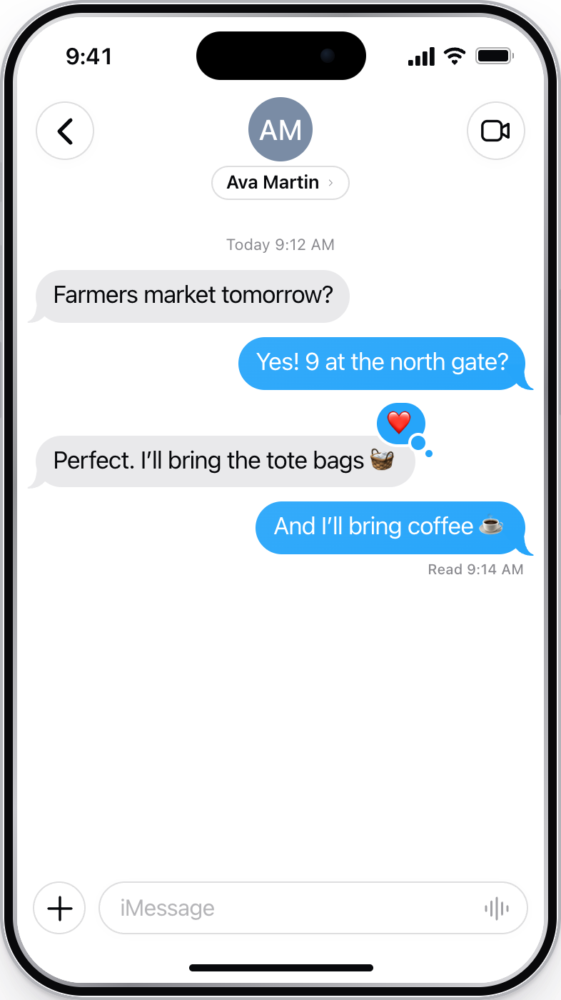
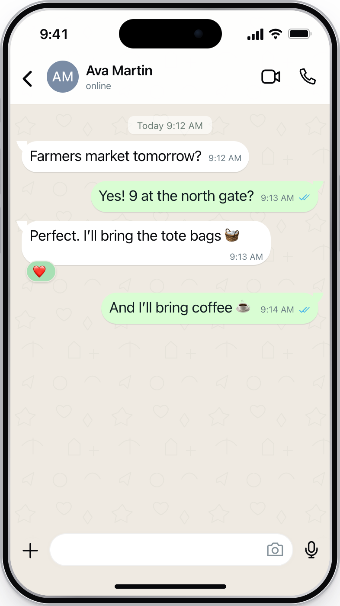

# Textmockups

Textmockups is a React component library for realistic iMessage, WhatsApp, Telegram, Instagram, and Google Messages chat mockups. You describe a conversation as a small JSON scene, and the `Phone` component draws it on an iPhone, Pixel, or Galaxy with the app's own bubbles, header, composer, receipts, and reactions.

It is the renderer behind [textmock.com](https://textmock.com), where you can [make one without code](https://textmock.com).

<p align="center">
  <picture>
    <source media="(prefers-color-scheme: dark)" srcset="docs/hero-imessage-dark.png">
    
  </picture>
  &nbsp;
  <picture>
    <source media="(prefers-color-scheme: dark)" srcset="docs/hero-whatsapp-dark.png">
    
  </picture>
</p>

[](LICENSE)

## Install

Install the compiled package from an immutable GitHub Release:

```json
{
  "dependencies": {
    "@hraness/textmockups": "https://github.com/hraness/textmockups/releases/download/v0.4.0/hraness-textmockups-0.4.0.tgz"
  }
}
```

```sh
bun install
```

React 18 or 19 is a peer dependency. The package ships compiled JavaScript, type declarations, and one stylesheet, so it works in Next.js, Vite, and other React setups without extra build configuration.

## Draw a chat in 30 seconds

```tsx
import { Phone, parseScene } from "@hraness/textmockups";
import "@hraness/textmockups/phone.css";

const scene = parseScene({
  version: 1,
  id: "saturday",
  platform: "whatsapp", // or "imessage", "telegram", "instagram", "google-messages"
  theme: "light",
  participants: [
    { id: "me", name: "You", isSelf: true },
    { id: "ava", name: "Ava Martin" },
  ],
  contact: { name: "Ava Martin", subtitle: "online", participantIds: ["ava"] },
  messages: [
    { id: "m1", senderId: "ava", text: "Farmers market tomorrow?", timestamp: "9:12 AM" },
    { id: "m2", senderId: "me", text: "Yes! 9 at the north gate?", timestamp: "9:13 AM", status: "read" },
  ],
});

export function Example() {
  return <Phone scene={scene} watermark={false} />;
}
```

`parseScene` fills in defaults (device, status bar, composer, appearance) and rejects anything outside the scene format, so a scene from a URL, a file, or a form is safe to render once it parses. `Phone` has no hooks and no effects, so it renders on the server and in static HTML. Drawing a scene never loads Zod, so pages with a strict Content-Security-Policy (no `unsafe-eval`) can hydrate `Phone` and play its timeline; validate scenes with `parseScene` on the server.

The result is a 393 × 852 iPhone. To fit it to the width of its container instead, with no script, use `PhoneFit`:

```tsx
<div style={{ maxWidth: 360 }}>
  <PhoneFit scene={scene} watermark={false} />
</div>
```

Set `device.frame` to `"none"` for the screen alone, or change `device.width`, `device.height`, and `device.scale`.

### iPhone and Android

A scene without a `device.model` draws the classic 393 × 852 iPhone, exactly as before. Set `device.model` to draw a real phone — its screen geometry, hardware frame, status bar, navigation, and keyboard all follow the model:

```tsx
parseScene({
  ...scene,
  platform: "google-messages",
  device: { model: "pixel-11-pro" },
});
```

| Model | System |
| --- | --- |
| `iphone-17-pro`, `iphone-17-pro-max` | iOS: Dynamic Island, iOS status bar and home indicator |
| `pixel-11`, `pixel-11-pro`, `pixel-11-pro-xl` | Pixel: Android status bar, gesture navigation, Gboard |
| `galaxy-s26`, `galaxy-s26-plus`, `galaxy-s26-ultra` | One UI: Android status bar, three-button navigation, Samsung Keyboard |

iMessage only runs on iPhone, and `google-messages` only runs on Android; the schema rejects mismatched scenes, including platform changes inside a timeline. Android text is set in the bundled Roboto Flex and Google Sans Flex fonts (`dist/fonts/`), which the stylesheet loads relative to itself — keep them next to `phone.css` if you host the assets yourself.

## What it draws

| App | Details |
| --- | --- |
| iMessage | Blue and gray bubbles with tails, tapbacks, Delivered and Read receipts, SMS and RCS green bubbles, effects (slam, loud, gentle, invisible ink), screen effects, typing indicator, focus status, pinned messages, replies, edits, unsend, and the iOS keyboard |
| WhatsApp | Doodle wallpaper, green outgoing bubbles, timestamps and blue double ticks inside the bubble, reactions, replies, voice notes, and the WhatsApp header and composer |
| Telegram | Telegram colors, wallpaper, ticks, reactions, and composer |
| Instagram | Direct message bubbles, Seen receipts, replies, and the Instagram composer |
| Google Messages | Android only: Material 3 colors, rounded asymmetric bubbles, RCS/SMS transports, corner delivery circles, Read receipts, and the Gboard-style composer |

Every app has light and dark themes, group chats, images, videos, voice messages, files, links, locations, contacts, stickers, polls, and payments.

## Animate a scene

Each message has an `at` time in seconds, and `timeline.tracks` can change any field over time (typing text, statuses, reactions). Pass `time` to draw one frame:

```tsx
<Phone scene={scene} time={2.5} />
```

`evaluateScene(scene, seconds)` returns the scene as it looks at that moment, and `sceneTime(scene, seconds)` applies the scene's duration and looping. Both are deterministic, so the same scene and time always draw the same frame, which is how textmock.com exports video.

## Bring your own media

Images and videos go through two replaceable slots. By default, images render with a plain `` (HTTPS URLs and small inline PNG, JPEG, or WebP), and videos show their poster frame. To load media from your own storage, pass components:

```tsx
<Phone scene={scene} media={{ Image: MyImage, Video: MyVideoFrame }} />
```

Scenes may reference browser-local files as `local:<sha256>`. The default image slot leaves those empty; an app that stores files locally passes an `Image` that resolves them.

## The scene format

A scene is version 1 JSON, capped at 256 KiB, 160 messages, and 300 seconds. The full contract is the Zod schema in [`src/schema.ts`](src/schema.ts), exported as `SceneSchema`, with `Scene`, `Message`, and `Participant` types. The [presets](src/presets.ts) (`presets` and `defaultScene`) are complete examples for each app.

Version 1 is fixed. Changes that would make an existing scene parse or draw differently ship as a new scene version.

## Used by

- [Textmock](https://textmock.com): an editor for fake text message screenshots and videos in iMessage, WhatsApp, Telegram, and Instagram.
- [TextButler](https://textbutler.app): the chat mockups on its homepage and launch post.

## Check it

```sh
bun install
bun run check
```

This type-checks the source, runs the tests (scene validation, the timeline, and server rendering of every preset), confirms the committed `dist/` matches the source, and installs the packed package into a clean project. `bun run gallery --shots .gallery` renders every preset in light and dark to PNG.

## Contributing

Issues and focused pull requests are welcome. See [CONTRIBUTING.md](CONTRIBUTING.md). Report security issues as described in [SECURITY.md](SECURITY.md).

## License

[MIT](LICENSE)
